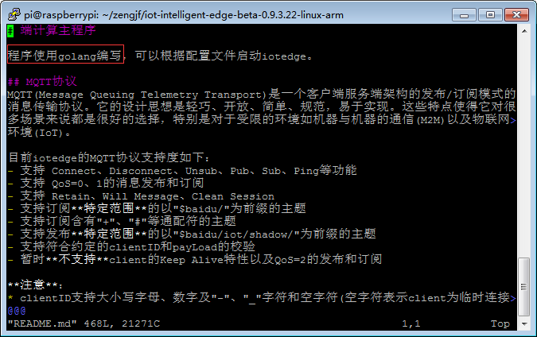
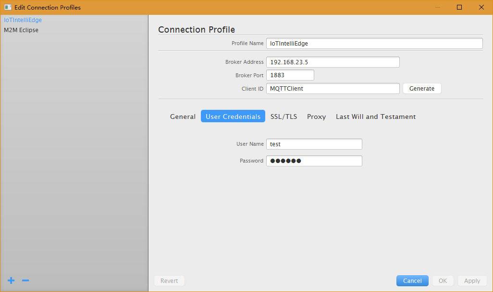
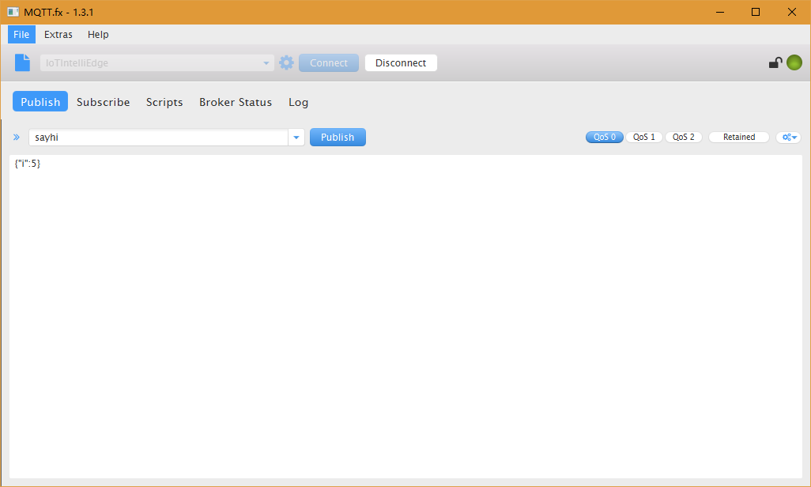
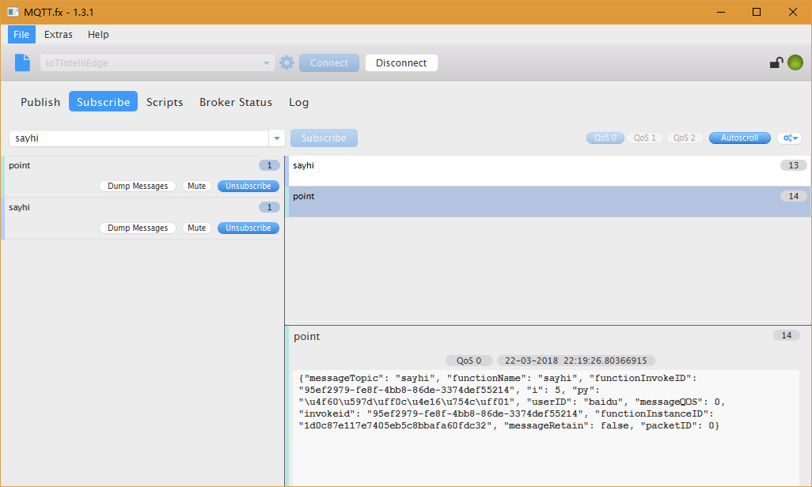
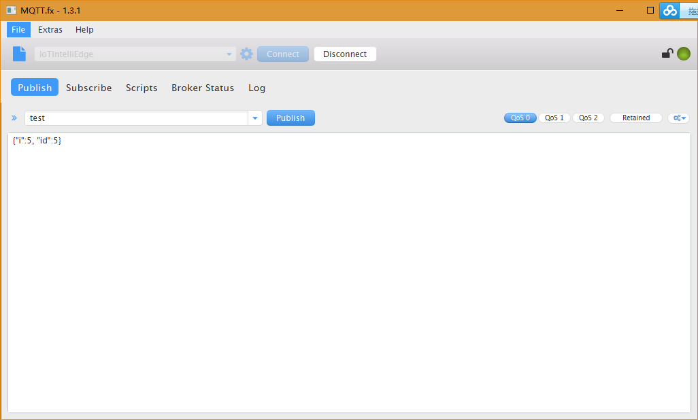
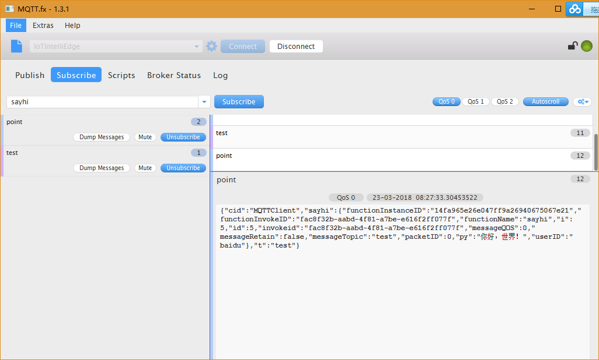

# RPi3 For Work

一个非常重要的理念，把`iotedge`当做一个扩充了百度附加功能的小型**broker**来理解。

## 测试环境说明：

* 本来想直接使用Buildroot文件系统在i.MX6上测试，结果发现程序是用Golang语言开发，由于对Golang不熟悉，仅折腾几天：  
  
* 查看`iotedge`文件类型：
  ```
  pi@raspberrypi:~/zengjf/iot-intelligent-edge-beta-0.9.3.22-linux-arm $ file bin/iotedge
  bin/iotedge: ELF 32-bit LSB executable, ARM, EABI5 version 1 (SYSV), statically linked, not stripped
  ```
* 由于`iotedge`可执行文件是`statically linked`，在Buildroot文件系统中运行应该是没问题的了，为确保起见，先使用树莓派3熟悉软件。

## RPi3环境搭建

### 打开SSH

[How to Enable SSH on a Raspberry Pi 3](https://www.youtube.com/watch?v=RgUM8ulMfHE)

### 安装工具包

`sudo apt-get install vim jq`  
备注：`Vim`是个人癖好。

### 解压软件包

1. `unzip iot-intelligent-edge-beta-0.9.3.22-linux-arm.zip`
2. 文档目录：
  ```
  pi@raspberrypi:~/zengjf $ tree
  .
  ├── iot-intelligent-edge-beta-0.9.3.22-linux-arm
  │   ├── bin
  │   │   └── iotedge
  │   ├── conf
  │   │   └── iotedge.yml
  │   ├── example
  │   │   └── function
  │   │       └── sayhi
  │   │           ├── __init__.py
  │   │           └── sayhi.py
  │   ├── libexec
  │   │   ├── iotedge_python2.7
  │   │   └── iotedge_sql
  │   └── README.md
  ├── iot-intelligent-edge-beta-0.9.3.22-linux-arm.zip
  └── __MACOSX
      └── iot-intelligent-edge-beta-0.9.3.22-linux-arm
          ├── bin
          ├── conf
          ├── example
          └── libexec
  
  13 directories, 8 files
  pi@raspberrypi:~/zengjf $
  ```

## iotedge Help

```Shell
pi@raspberrypi:~/zengjf/iot-intelligent-edge-beta-0.9.3.22-linux-arm $ bin/iotedge -h
Usage of bin/iotedge:
  -c string
        Config file (default "conf/iotedge.yml")
  -h    Show this help
  -w string
        Working directory (default "/home/pi/zengjf/iot-intelligent-edge-beta-0.9.3.22-linux-arm")
```

## 运行iotedge查看端口监听

* 列出未运行`iotedge`网络监听端口：
  ```Shell
  pi@raspberrypi:~/zengjf/iot-intelligent-edge-beta-0.9.3.22-linux-arm $ netstat -atunlp
  (Not all processes could be identified, non-owned process info
   will not be shown, you would have to be root to see it all.)
  Active Internet connections (servers and established)
  Proto Recv-Q Send-Q Local Address           Foreign Address         State       PID/Program name
  tcp        0      0 0.0.0.0:22              0.0.0.0:*               LISTEN      -
  tcp        0     64 192.168.23.5:22         192.168.23.1:59575      ESTABLISHED -
  tcp6       0      0 :::22                   :::*                    LISTEN      -
  udp        0      0 0.0.0.0:5353            0.0.0.0:*                           -
  udp        0      0 0.0.0.0:68              0.0.0.0:*                           -
  udp        0      0 0.0.0.0:45652           0.0.0.0:*                           -
  udp6       0      0 :::5353                 :::*                                -
  udp6       0      0 :::56418                :::*                                -
  ```
* 开启`iotedge`：
  ```Shell
  pi@raspberrypi:~/zengjf/iot-intelligent-edge-beta-0.9.3.22-linux-arm $ ./bin/iotedge &
  [1] 2336
  ```
* 列出运行iotedge后网络监听端口：
  ```Shell
  pi@raspberrypi:~/zengjf/iot-intelligent-edge-beta-0.9.3.22-linux-arm $ netstat -atunlp
  (Not all processes could be identified, non-owned process info
   will not be shown, you would have to be root to see it all.)
  Active Internet connections (servers and established)
  Proto Recv-Q Send-Q Local Address           Foreign Address         State       PID/Program name
  tcp        0      0 0.0.0.0:22              0.0.0.0:*               LISTEN      -
  tcp        0    256 192.168.23.5:22         192.168.23.1:59575      ESTABLISHED -
  tcp6       0      0 :::22                   :::*                    LISTEN      -
  tcp6       0      0 :::1883                 :::*                    LISTEN      2336/./bin/iotedge
  udp        0      0 0.0.0.0:5353            0.0.0.0:*                           -
  udp        0      0 0.0.0.0:68              0.0.0.0:*                           -
  udp        0      0 0.0.0.0:45652           0.0.0.0:*                           -
  udp6       0      0 :::5353                 :::*                                -
  udp6       0      0 :::56418                :::*                                -
  pi@raspberrypi:~/zengjf/iot-intelligent-edge-beta-0.9.3.22-linux-arm $
  ```
* 对比以上输出信息，可知默认`iotedge`是打开了`tcp 1883`端口监听，与`conf/iotedge.yml`中配置吻合；
  ```
  listen:
    - tcp://:1883
  [...省略]
  ```

## MQTT.fx 连接测试

### 配置连接



### 测试sayhi主题

* Publish
  ```JSON
  {
    "i": 5
  }
  ```
  
* Subscribe  
  ```JSON
  {
    "messageTopic": "sayhi",
    "functionName": "sayhi",
    "functionInvokeID": "ae9618f6-3db0-45ee-b67e-70a831e71299",
    "i": 5,
    "py": "你好，世界！",
    "userID": "baidu",
    "messageQOS": 0,
    "invokeid": "ae9618f6-3db0-45ee-b67e-70a831e71299",
    "functionInstanceID": "14fa965e26e047ff9a26940675067e21",
    "messageRetain": false,
    "packetID": 0
  }
  ```
  

### 测试test主题

* Publish
  ```
  {
    "i": 5,
    "id": 5
  }
  ```
  
* Subscribe  
  ```
  {
    "cid": "MQTTClient",
    "sayhi": {
      "functionInstanceID": "14fa965e26e047ff9a26940675067e21",
      "functionInvokeID": "fac8f32b-aabd-4f81-a7be-e616f2ff077f",
      "functionName": "sayhi",
      "i": 5,
      "id": 5,
      "invokeid": "fac8f32b-aabd-4f81-a7be-e616f2ff077f",
      "messageQOS": 0,
      "messageRetain": false,
      "messageTopic": "test",
      "packetID": 0,
      "py": "你好，世界！",
      "userID": "baidu"
    },
    "t": "test"
  }
  ```
  

## Log日志修改、查看

### 默认Log日志

```
pi@raspberrypi:~/zengjf/iot-intelligent-edge-beta-0.9.3.22-linux-arm$ cat var/log/iotedge.log 
time="2018-03-22T11:41:43Z" level=info msg="Create function instance successfully" component=funclet instance=8179bf66414743aa84d7b241b2381cc1 name=sayhi process=1558
time="2018-03-22T11:41:43Z" level=info msg="Setup function manager successfully" component=service
time="2018-03-22T11:41:44Z" level=info msg="Setup broker successfully" component=service
time="2018-03-22T11:41:44Z" level=info msg="Device not configured" component=device_manager error="cloud.device not found"
time="2018-03-22T11:41:44Z" level=info msg="[TCP] endpoint=tcp://:1883, ssl=false" component=server
time="2018-03-22T11:41:53Z" level=info msg="Session connected successfully" clientID=MQTTClient component=session
time="2018-03-22T11:42:10Z" level=info msg="Subscribe successfully" clientID=MQTTClient component=session subTopic=sayhi
time="2018-03-22T11:42:20Z" level=error msg="No permission to subscribe" clientID=MQTTClient component=session subTopic=print
time="2018-03-22T11:42:20Z" level=error msg="Subscribe topic failed" clientID=MQTTClient component=session subTopic=print
time="2018-03-22T11:42:43Z" level=info msg="Subscribe successfully" clientID=MQTTClient component=session subTopic=point
```
### 修改Log日志级别为`debug`

* `conf/iotedge.yml`
  ```
  [...省略]
  logger:
    level: 'debug'
  ```
* 测试`test`主题输出日志信息
  ```
  pi@raspberrypi:~/zengjf/iot-intelligent-edge-beta-0.9.3.22-linux-arm $ cat var/log/iotedge.log
  time="2018-03-23T00:44:44Z" level=debug msg="Function instance start arguments: [/home/pi/zengjf/iot-intelligent-edge-beta-0.9.3.22-linux-arm/libexec/iotedge_python2.7 /home/pi/zengjf/iot-intelligent-edge-beta-0.9.3.22-linux-arm/libexec/iotedge_python2.7 /home/pi/zengjf/iot-intelligent-edge-beta-0.9.3.22-linux-arm/example/function/sayhi sayhi.handler 5ee058fa48ae410ea615bd67a2a0786f]" component=function name=sayhi
  time="2018-03-23T00:44:44Z" level=info msg="Create function instance successfully" component=funclet instance=5ee058fa48ae410ea615bd67a2a0786f name=sayhi process=3812
  time="2018-03-23T00:44:44Z" level=info msg="Setup function manager successfully" component=service
  time="2018-03-23T00:44:44Z" level=info msg="Setup broker successfully" component=service
  time="2018-03-23T00:44:44Z" level=info msg="Device not configured" component=device_manager error="cloud.device not found"
  time="2018-03-23T00:44:44Z" level=info msg="[TCP] endpoint=tcp://:1883, ssl=false" component=server
  time="2018-03-23T00:44:50Z" level=debug msg="Create session successfully" component=session_manager
  time="2018-03-23T00:44:50Z" level=debug msg="Get 0 subscription(s) successfully: clientID=ses.MQTTClient" component=recorder
  time="2018-03-23T00:44:50Z" level=debug msg="Clean session state successfully" clientID=MQTTClient component=session
  time="2018-03-23T00:44:50Z" level=info msg="Session connected successfully" clientID=MQTTClient component=session
  time="2018-03-23T00:44:54Z" level=info msg="Subscribe successfully" clientID=MQTTClient component=session subTopic=point
  time="2018-03-23T00:44:54Z" level=debug msg="Get 0 retaind message(s) successfully" component=recorder
  time="2018-03-23T00:44:58Z" level=info msg="Subscribe successfully" clientID=MQTTClient component=session subTopic=test
  time="2018-03-23T00:44:58Z" level=debug msg="Get 0 retaind message(s) successfully" component=recorder
  time="2018-03-23T00:45:03Z" level=debug msg="Receive message successfully: pid=0, dup=false, retain=false, qos=0, topic=test" clientID=MQTTClient component=session
  time="2018-03-23T00:45:03Z" level=debug msg="Fetch 1 message(s) successfully" component=sinker sinker=function
  time="2018-03-23T00:45:03Z" level=debug msg="Fetch 1 message(s) successfully" component=sinker sinker=ses.MQTTClient
  time="2018-03-23T00:45:03Z" level=debug msg="Function instance start arguments: [/home/pi/zengjf/iot-intelligent-edge-beta-0.9.3.22-linux-arm/libexec/iotedge_sql /home/pi/zengjf/iot-intelligent-edge-beta-0.9.3.22-linux-arm/libexec/iotedge_sql /home/pi/zengjf/iot-intelligent-edge-beta-0.9.3.22-linux-arm select clientid() as cid, topic() as t, @@sayhi(select *) as sayhi where id < 10 156998d1613344d2bc6029ef80e6a433]" component=function name=filter
  time="2018-03-23T00:45:03Z" level=debug msg="Route message to 1 subscription(s)" component=router sequence=1 sinker=function topic=test
  time="2018-03-23T00:45:03Z" level=debug msg="Route message to 1 subscription(s)" component=router sequence=1 sinker=ses.MQTTClient topic=test
  time="2018-03-23T00:45:03Z" level=info msg="Create function instance successfully" component=funclet instance=156998d1613344d2bc6029ef80e6a433 name=filter process=3818
  time="2018-03-23T00:45:03Z" level=debug msg="Fetch 1 message(s) successfully" component=sinker sinker=topic
  time="2018-03-23T00:45:03Z" level=debug msg="Persist 1 message(s) successfully" component=broker
  time="2018-03-23T00:45:03Z" level=debug msg="Persist 1 offset(s) successfully" component=broker
  time="2018-03-23T00:45:03Z" level=debug msg="Function invoke elapsed time: 1.831278ms" component=funclet instance=5ee058fa48ae410ea615bd67a2a0786f name=sayhi process=3812
  time="2018-03-23T00:45:03Z" level=debug msg="Function invoke elapsed time: 30.920591ms" component=funclet instance=156998d1613344d2bc6029ef80e6a433 name=filter process=3818
  time="2018-03-23T00:45:03Z" level=debug msg="Persist 1 message(s) successfully" component=broker
  time="2018-03-23T00:45:03Z" level=debug msg="Fetch 1 message(s) successfully" component=sinker sinker=ses.MQTTClient
  time="2018-03-23T00:45:03Z" level=debug msg="Fetch 1 message(s) successfully" component=sinker sinker=function
  time="2018-03-23T00:45:03Z" level=debug msg="Fetch 1 message(s) successfully" component=sinker sinker=topic
  time="2018-03-23T00:45:03Z" level=debug msg="Route message to 1 subscription(s)" component=router sequence=2 sinker=topic topic="$function/filter"
  time="2018-03-23T00:45:04Z" level=debug msg="Fetch 1 message(s) successfully" component=sinker sinker=function
  time="2018-03-23T00:45:04Z" level=debug msg="Fetch 1 message(s) successfully" component=sinker sinker=ses.MQTTClient
  time="2018-03-23T00:45:04Z" level=debug msg="Route message to 1 subscription(s)" component=router sequence=3 sinker=ses.MQTTClient topic=point
  time="2018-03-23T00:45:04Z" level=debug msg="Persist 1 offset(s) successfully" component=broker
  time="2018-03-23T00:45:04Z" level=debug msg="Fetch 1 message(s) successfully" component=sinker sinker=topic
  time="2018-03-23T00:45:04Z" level=debug msg="Persist 1 message(s) successfully" component=broker
  time="2018-03-23T00:45:04Z" level=debug msg="Persist 1 offset(s) successfully" component=broker
  time="2018-03-23T00:45:04Z" level=debug msg="Persist 1 offset(s) successfully" component=broker
  pi@raspberrypi:~/zengjf/iot-intelligent-edge-beta-0.9.3.22-linux-arm $
  ```
