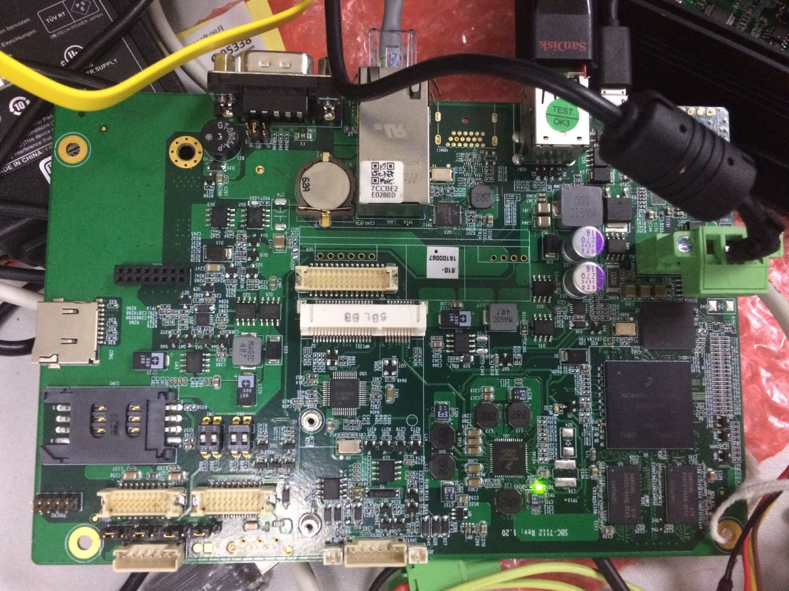
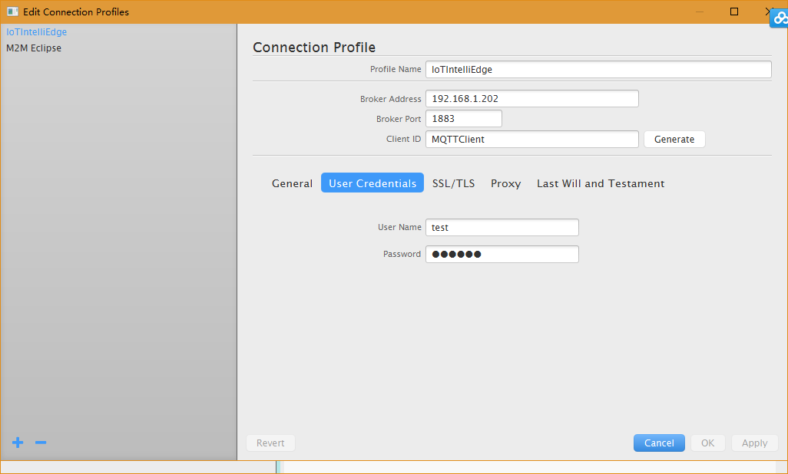
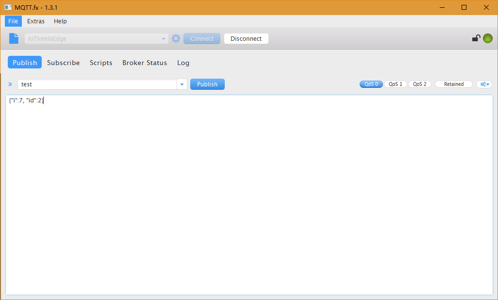
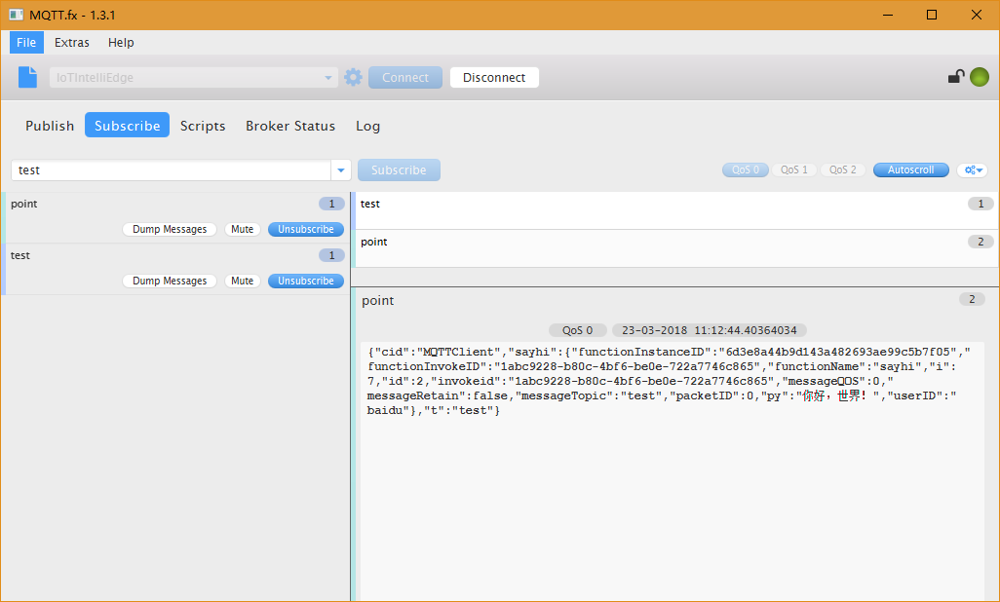

# i.MX6 Buildroot Run iotedge

* 个人Buildroot仓库：https://github.com/ZengjfOS/Buildroot
* 支持iotedge的Buildroot配置：https://github.com/ZengjfOS/Buildroot/blob/master/customize/configs/freescale_imx6dlsabresd_pi2_defconfig

`iotedge`可执行文件是`statically linked`，可以独立运行，所以不用做移植，简化了工作；

## 主板



## iotedge运行、Log日志、监听端口检查 

```
[buildroot@root ~]#  netstat -atunl
Active Internet connections (servers and established)
Proto Recv-Q Send-Q Local Address           Foreign Address         State
tcp        0      0 0.0.0.0:21              0.0.0.0:*               LISTEN
tcp        0      0 0.0.0.0:22              0.0.0.0:*               LISTEN
tcp        0    144 192.168.1.202:22        192.168.1.20:7585       ESTABLISHED
tcp        0      0 :::80                   :::*                    LISTEN
tcp        0      0 :::22                   :::*                    LISTEN
udp        0      0 192.168.1.202:123       0.0.0.0:*
udp        0      0 127.0.0.1:123           0.0.0.0:*
udp        0      0 0.0.0.0:123             0.0.0.0:*
udp        0      0 fe80::a4c2:53ff:fe0a:4185:123 :::*
udp        0      0 ::1:123                 :::*
udp        0      0 :::123                  :::*
[buildroot@root ~/iot-intelligent-edge-beta-0.9.3.22-linux-arm]#  ./bin/iotedge &
[buildroot@root ~/iot-intelligent-edge-beta-0.9.3.22-linux-arm]#  cat var/log/iotedge.log
time="1970-01-01T00:02:03Z" level=info msg="Create function instance successfully" component=funclet instance=6d3e8a44b9d143a482693ae99c5b7f05 name=sayhi process=311
time="1970-01-01T00:02:03Z" level=info msg="Setup function manager successfully" component=service
time="1970-01-01T00:02:03Z" level=info msg="Setup broker successfully" component=service
time="1970-01-01T00:02:03Z" level=info msg="Device not configured" component=device_manager error="cloud.device not found"
time="1970-01-01T00:02:03Z" level=info msg="[TCP] endpoint=tcp://:1883, ssl=false" component=server
[buildroot@root ~/iot-intelligent-edge-beta-0.9.3.22-linux-arm]#  netstat -atunl
Active Internet connections (servers and established)
Proto Recv-Q Send-Q Local Address           Foreign Address         State
tcp        0      0 0.0.0.0:21              0.0.0.0:*               LISTEN
tcp        0      0 0.0.0.0:22              0.0.0.0:*               LISTEN
tcp        0    144 192.168.1.202:22        192.168.1.20:7585       ESTABLISHED
tcp        0      0 :::80                   :::*                    LISTEN
tcp        0      0 :::22                   :::*                    LISTEN
tcp        0      0 :::1883                 :::*                    LISTEN
tcp        0      0 ::ffff:192.168.1.202:1883 ::ffff:192.168.1.20:7594 ESTABLISHED
udp        0      0 192.168.1.202:123       0.0.0.0:*
udp        0      0 127.0.0.1:123           0.0.0.0:*
udp        0      0 0.0.0.0:123             0.0.0.0:*
udp        0      0 fe80::a4c2:53ff:fe0a:4185:123 :::*
udp        0      0 ::1:123                 :::*
udp        0      0 :::123                  :::*
[buildroot@root ~/iot-intelligent-edge-beta-0.9.3.22-linux-arm]#
```

## MQTT.fx test主题连接测试

* Configure
  
* Publish
  
* Subscribe
  

## 查看`event_context.txt`

```
[buildroot@root ~/iot-intelligent-edge-beta-0.9.3.22-linux-arm]#  cat var/run/event_context.txt
event type: <type 'dict'>
context type: <class '__main__.Context'>
event data: {u'i': 7, u'id': 2}
context data: {u'messageTopic': u'test', u'functionName': u'sayhi', u'functionInvokeID': u'1abc9228-b80c-4bf6-be0e-722a7746c865', u'timestamp': 589, u'sequenceID': 1, u'messageQOS': 0, u'clientID': u'MQTTClient', u'invokeid': u'1abc9228-b80c-4bf6-be0e-722a7746c865', u'functionInstanceID': u'6d3e8a44b9d143a482693ae99c5b7f05', u'messageRetain': False, u'packetID': 0}
[buildroot@root ~/iot-intelligent-edge-beta-0.9.3.22-linux-arm]#
```

